# Guia de uso do Kubeflow em ambiente on-premise
Este guia elucida a instalação e o uso do Kubeflow em ambiente computacional de alto desempenho on-premise. Isto é, instalar o Kubeflow em uma máquina local, não em uma máquina de um provedor de nuvem, e utilizá-lo aproveitando toda potência do hardware disponível e as vantagens do ambiente local.

O Guia está separado em tutoriais diversos, que cobrem detalhadamente desde a instalação do Kubeflow na máquina do zero, partindo-se da instalação das dependências, até a criação e execução de pipelines sofisticados, com GPUs.

# Autoria
Este guia foi produzido por estagiários, alunos de iniciação científica, mestrandos e doutorandos do Centro Interdisciplinar de Tecnologias Interativas da Universidade de São Paulo (CITI-USP), como resultado de uma série de investigações no uso do Kubeflow para treinamento de modelos de visão computacional no cluster ASIMOV, equipado com um hardware potente.

- **Henrique S. Souza** (`@henriqueedu2001`): aluno de iniciação científica, estudante de engenharia de computação na USP.
- **Vicente Pascoal** (`@Vicente-VP`): estagiário, estudante de análise e desenvolvimento de sistemas na FATEC.

# Premissas
Assume-se que você tenha uma máquina ou um cluster de máquinas com alto poder computacional, equipado com GPUs da NVIDIA, em que deseja instalar o Kubeflow, para praticar ML Ops. A máquina pode tanto ser acessível diretamente, isto é, você mesmo tem acesso físico a ela e pode abrir um terminal nela, ou acessível indiretamente, via conexões SSH.

# Estrutura do Guia
O guia estrutura-se em (a) tutoriais de instalação e uso do Kubeflow e (b) resolução de problemas comuns. Conforme a árvore abaixo, ambos são apresentados dentro do diretório `/docs`, nas pastas `/tutorials` e `/troubleshooting`. Dentro de cada uma delas, há uma série de arquivos de extensão `.md` que explicam o assunto.

```text
.
├── docs/
│    └─── tutorials
│          └─── common_server_operations.md
│          └─── ssh_remote_access.md
|          ...
│    └─── troubleshooting
│          └─── ssh_errors.md
│          └─── kubeflow_dependencies.md
│          ...
├── src/
├── LICENSE
└── README.md
```

Este repositório documenta como é feita a instalação do Kubeflow completo e como criar seu primeiro pipeline. Executando-se o script main.py, gera-se uma especificação de pipeline pipeline.yaml, que pode ser enviada para um backend de Kubeflow e executada nele em uma run.

O pipeline de exemplo é composto por um único componente `say_hello(name)`, que, munido de uma string `name`, imprime a string `Hello, <name>!`, conforme a implementação abaixo.

```python
@dsl.component
def say_hello(name: str) -> str:
    hello_text = f'Hello, {name}!'
    print(hello_text)
    return hello_text
```

# Tópicos
- [Acessar VM](#acessar-vm)
- [Instalação Kubeflow](#instalacao-kubeflow)
  - [Docker](#docker)
  - [Kubectl](#kubectl)
  - [Kustomize](#kustomize)
  - [Kind](#kind)
  - [Instalação da Plataforma Kubeflow](#instalacao-da-plataforma-kubeflow)
- [Acesso ao Kubeflow](#acesso-ao-kubeflow)
- [Como criar um Pipeline](#como-criar-um-pipeline)
  - [Baixar Arquivo YAML da VM](#baixar-arquivo-yaml-da-vm)
  - [Criar e Rodar um Pipeline no Kubeflow](#criar-e-rodar-um-pipeline-no-kubeflow)
- [Erros Encontrados](#erros-encontrados)
  - [Recursos Necessários](#recursos-necessarios)
  - [Snap](#snap)
  - [Tempo](#tempo)
  - [ErrPullImage](#errpullimage)
  - [CrashLoopBackOf](#crashloopbackof)

## Acessar VM
**Abrir Power Shell** </br>
Caso esteja no **windows** clique na tecla windows e digite `Power Shell`

**Trello** </br>
Para obter o comando de acesso a VM você deve acessar o Trello através deste Link [Trello](https://trello.com/c/fM6MPRKX/27-acesso-%C3%A0s-vms).
</br>
- Digite no terminal o seguinte comando substituindo as informações `ssh -p<porta> -L 8080:localhost:8080 <user>@<IP_VM>`
- Copie a senha e cole no terminal

Verifique se o caminho do terminal ficou verde !!

## Instalação Kubeflow
Na instalação do Kubeflow primeiro é necessário a instalação de alguns componentes para termos o funcionamento completo da plataforma.


### Docker
Docker é uma ferramenta que nos permite executar aplicações em contêineres.

**Remover Versões Antigas** 
```bash
sudo apt remove docker docker-engine docker.io containerd runc
```

**Configurar Repositório**
```bash
sudo apt update
sudo apt install ca-certificates curl gnupg
sudo install -m 0755 -d /etc/apt/keyrings
curl -fsSL https://download.docker.com/linux/ubuntu/gpg | sudo gpg --dearmor -o /etc/apt/keyrings/docker.gpg
sudo chmod a+r /etc/apt/keyrings/docker.gpg
```

**Adicionar Repositório Docker**
```bash
echo \
  "deb [arch=$(dpkg --print-architecture) signed-by=/etc/apt/keyrings/docker.gpg] https://download.docker.com/linux/ubuntu \
  $(lsb_release -cs) stable" | \
  sudo tee /etc/apt/sources.list.d/docker.list > /dev/null
```

**Instalar Docker Engine**
```bash
sudo apt update
sudo apt install docker-ce docker-ce-cli containerd.io docker-buildx-plugin docker-compose-plugin
```

**Permitir rodar Docker sem Sudo**
```bash
sudo usermod -aG docker $USER
```

Agora reinicie seu sistema !!!

**Teste de Funcionamento**
```bash
docker run hello-world
```
O retorno será um Hello World e a criação de um conteiner. 

(Caso tenha algum erro na hora de tentar rodar o teste utilize o comando sudo ou volte para o Passo anterior ao Teste)

[Video Tutorial Instalação Docker](https://www.youtube.com/watch?v=lRnCN475cto)

### Kubectl
Kubectl é uma ferramenta de linha de comando para controlar cluster Kubernetes

**Instalação**
```bash
curl -LO "https://dl.k8s.io/release/$(curl -L -s https://dl.k8s.io/release/stable.txt)/bin/linux/amd64/kubectl"
chmod +x kubectl
sudo mv kubectl /usr/local/bin/
```

**Verificar Instalação**
```bash
kubectl version --client
```
O retorno será o terminal mostrando a versão da ferramenta

[Video Tutorial Instalação Kubectl](https://www.youtube.com/watch?v=tqLUauXS-VA)

### Kustomize
Kustomize é  uma ferramenta nativa do Kubernetes para personalizar arquivos de configuração YAWML sem usar modelos.

**Baixar aquivo**
```bash
curl -LO https://github.com/kubernetes-sigs/kustomize/releases/latest/download/kustomize_linux_amd64.tar.gz
tar -xvf kustomize_linux_amd64.tar.gz
chmod +x kustomize
```

**Mover para um local Global**
```bash
sudo mv kustomize /usr/local/bin/
rm kustomize_linux_amd64.tar.gz
```

**Verificar Instalação**
```bash
kustomize version
```

[Chat Tutorial Intalação Kustomize](https://chatgpt.com/share/69416398-3044-8005-aa8b-24d26c3357a4)

O retorno será o terminal mostrando a versão da ferramenta

### Kind
O Kind é uma ferramenta que executa cluster Kubernetes locais usando contêineres Docker.

**Instalação**
```bash
curl -Lo ./kind https://kind.sigs.k8s.io/dl/latest/kind-linux-amd64
chmod +x kind
sudo mv kind /usr/local/bin/
```

**Verificar Instalação**
```bash
kind --version
```
[Video Tutorial Instalação Kind](https://www.youtube.com/watch?v=_m_ZCAmnc_k)

O retorno será o terminal mostrando a versão da ferramenta

### Instalação da Plataforma Kubeflow

**Criar CLuster Kubernetes com Kind**
 ```bash
cat <<EOF | kind create cluster --name=kubeflow --config=-
kind: Cluster
apiVersion: kind.x-k8s.io/v1alpha4
nodes:
  - role: control-plane
    image: kindest/node:v1.31.0
    kubeadmConfigPatches:
      - |
        kind: ClusterConfiguration
        apiServer:
          extraArgs:
            "service-account-issuer": "kubernetes.default.svc"
            "service-account-signing-key-file": "/etc/kubernetes/pki/sa.key"
EOF
```

**Verificar se contexto aponta para cluster Correto**
```bash
kubectl cluster-info --context kind-kubeflow
```

**Clonar Repositório de manifests do Kubeflow**
```bash
git clone https://github.com/kubeflow/manifests.git
cd manifests
```

**Instalar a Plataforma**
```bash
while ! kustomize build example | kubectl apply --server-side --force-conflicts -f -; do
  echo "Retrying to apply resources"
  sleep 20
done
```
Este comando demora, então aguarde cerca de 10 min. Após verifique os pods com o comando: 

```bash
kubectl get pods -A
```
Caso tenha algum pod com `Creating`, `CrashLoopBackOf` ou algo semelhante espere alguns minutos para eles se normalizarem !!

## Acesso ao Kubeflow

**Acesso ao dashboard completo**
```bash
kubectl port-forward svc/istio-ingressgateway -n istio-system 8080:80
```
- Usuário padrão: user@example.com
- Senha padrão: 12341234

**Acesso ao Kubeflow Pipelines**
```bash
kubectl port-forward -n kubeflow svc/ml-pipeline-ui 8080:80
```

**Digitar URL**
```bash
http://localhost:8080
```

## Como criar um Pipeline

**Instalar Pacote para .env (Caso ainda não esteja instalada)**
```bash
sudo apt install python3-venv -y
```

**Criar ambiente virtual (Caso ainda não criada)**
```bash
python3 -m venv kfp-env
```

**Ativar**
```bash
source kfp-env/bin/activate
```
o retorno será `(kfp-env) user@vm:~`

**Instalar versão KFP (Caso ainda não esteja instalada)**
```bash
pip install kfp==2.14.3
```

ou

```bash
pip install kfp
```

**Clonar Repositório**
```bash
git clone https://github.com/henriqueedu2001/kubeflow-installation.git
```

**Entrar Repositório**
```bash
cd kubeflow-installation
```

**Gerar Pipeline**
```bash
python3 main.py
```

**Verificar se gerou .YAML**
```bash
ls
```
O retorno deve ter um arquivo YAML

### Baixar Arquivo YAML da VM
Caso você tenha feito o arquivo .YAML através do **Asimov** você precisará baixa-lo em sua maquina pra conseguir coloca-lo em um pipeline no **Kubeflow**.

**Abrir PowerShell**
Caso esteja no **windows** clique na tecla windows e digite `Power Shell`

**Comando Para Baixar**
Sem se conectar a VM digite este comando: 

```bash
scp -P PORTA_VM oper@IP_DA_VM:/home/oper/pipeline.yaml .
```

**Onde Encontrar arquivo**
Esse arquivo baixado estará no mesmo caminho do PowerShell. Provavelmente o seu estará mais ou menos assim: `C:\Users\Seu_user>`

### Criar e Rodar um Pipeline no Kubeflow
Vá até Pipelines no menu lateral 
<p style='text-align: center;'>
    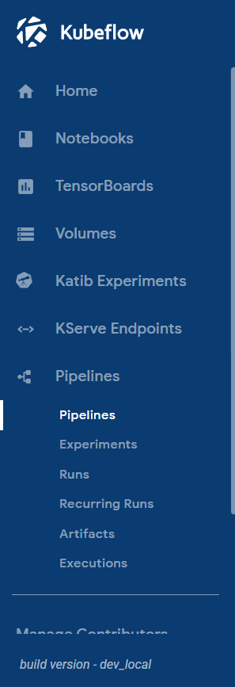</img>
</p>

**Upload Pipeline** </br>
Clique no Botão `+ Upload pipeline`
<p style='text-align: center;'>
    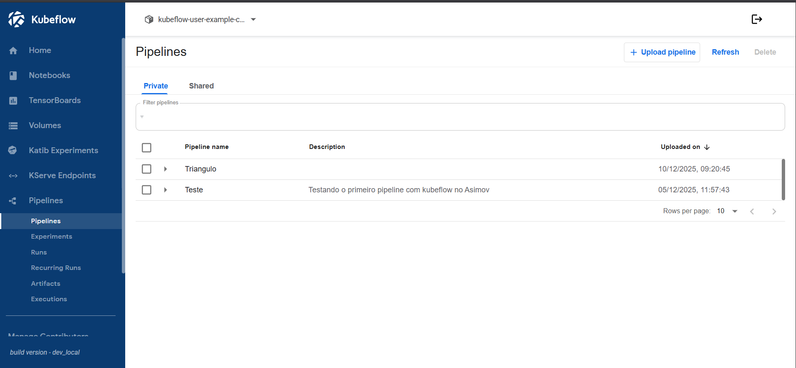</img>
</p>

**Criar Pipeline**
</br>
Coloque o nome do pipeline e uma descrição. 
Exemplo:
- nome: `Teste`
- descrição: `Primeiro Teste com Kubeflow Pipelines`
<p style='text-align: center;'>
    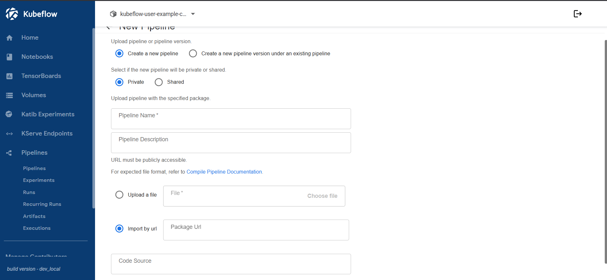</img>
</p>

Faça o Upload do arquivo .YAML que foi baixado anteriormente com o nome `pipeline.yaml` e clique em criar
<p style='text-align: center;'>
    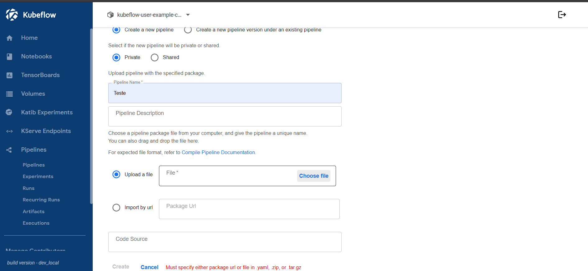</img>
</p>

**Experiments**
</br>
Ir até Experiments no menu lateral 
<p style='text-align: center;'>
    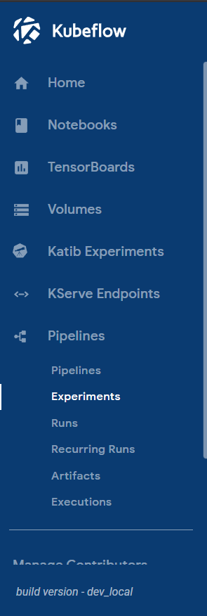</img>
</p>

**Create Experiment** </br>
Clique no Botão `+ Create experiment`
<p style='text-align: center;'>
    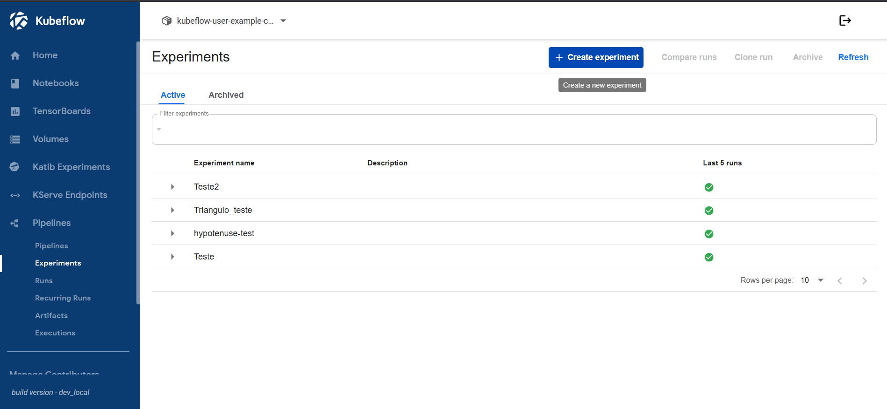</img>
</p>

**Criar Experiment**
</br>
Coloque o nome do experiment e uma descrição.
Exemplo:
- nome: `Teste`
- descrição: `Primeiro Experiment com Kubeflow Pipelines`
<p style='text-align: center;'>
    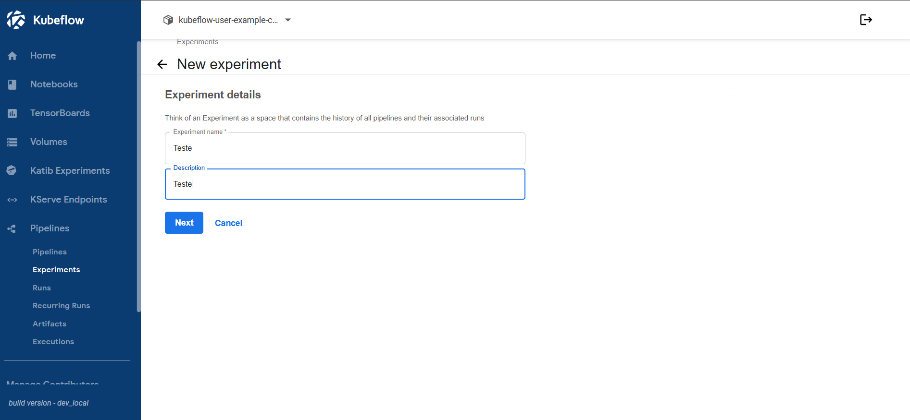</img>
</p>

**Detalhes**
</br>
Escolha o Pipeline já criado anteriormente (Caso tenha feito igual  o tutorial o nome será `Teste`)
<p style='text-align: center;'>
    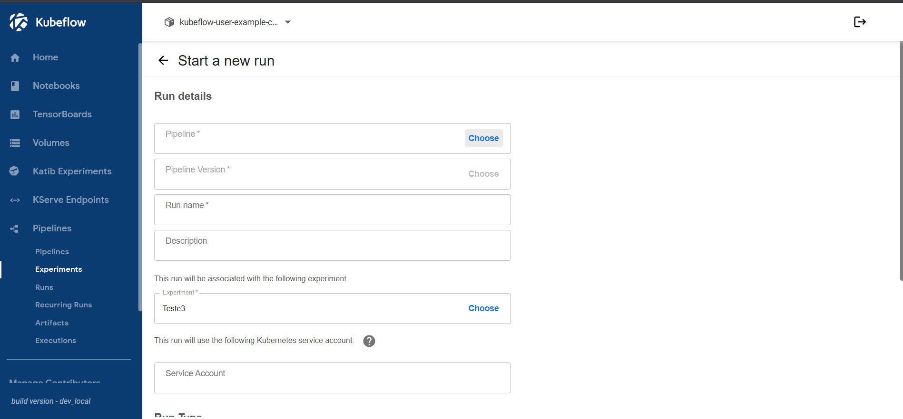</img>
</p>

De um nome e descrição para a Run.
Exemplo:
- run nome: `Primeira Run Teste`
- descrição: `Testando Pipeline`
<p style='text-align: center;'>
    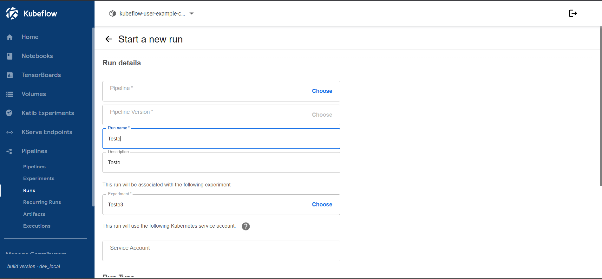</img>
</p>

Coloque os paraâmetros necessários para a run.
Exemplo:
- primeiro numero: `4`
- segundo numero: `4`
<p style='text-align: center;'>
    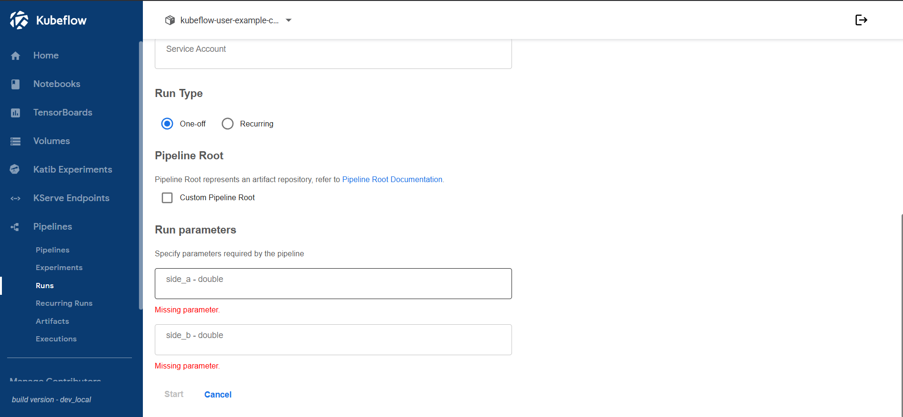</img>
</p>

Só apertar em start e já  irá começar a run
<p style='text-align: center;'>
    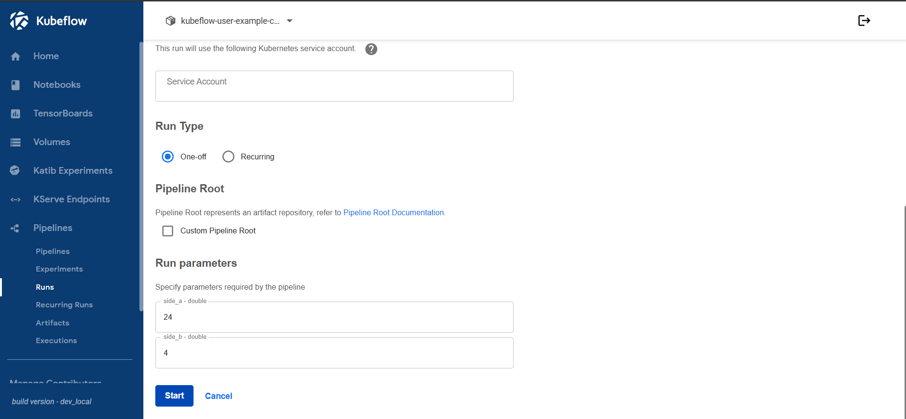</img>
</p>

**Run**
</br>
Assim que você criou o Experiment você será direcionado para a run. A partir do momento que tudo ficar verde na sua tela quer dizer que o Pipeline deu certo 
<p style='text-align: center;'>
    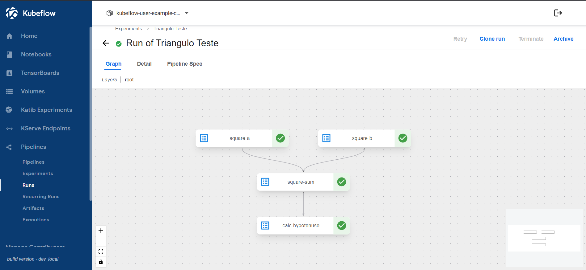</img>
</p>

Caso não tenha entendido veja este video explicando como funciona para criação de um pipeline
[Video Tutorial Pipelines](https://www.youtube.com/watch?v=5iOQcGfcZe4&t=2413s)

## Erros Encontrados

### Recursos Necessários
Para utilização do você precisa dos seguintes recursos computacionais:

- 8 CPUs
- 60GB RAM

Sem isso os nós eles não sobem e você nunca conseguira subir o Kubeflow completo. (Caso queira alguns componentes é melhor pesquisar quanto é necessário pra cada um)

### Snap
Na instalação de cada um dos requisitos evite de instalar através do snap, pois a instalação não vem corretamente. 

### Tempo
A instalação do Kubeflow é bem demorada, então o ideal é que depois de rodar o comando de instalação esperar até que o comando seja finalizado. Caso o comando demore mais de 15min a 20min é bem provavel que tenha dado erro em alguma parte da instalação.

### ErrPullImage
Esse erro acontece ao tentar fazer instalação apenas do componente de Kubeflow pipelines usando o addon do **minikube**. Esse erro acontece porque ele tenta puxar a imagem de um local que não a possui mais. (Não conseguimos resolver)

### CrashLoopBackOf
Erro indica que o pod nã foi iniciado corretamente. Acontece por dois motivos, o primeiro e mais provável é que esse pod depende de outro assim ele não inicia corretamente e o segundo pode ser uma falha dentro do pod. Para tentar descobrir onde está a falha de o seguinte comando `kubectl describe pod <nome-do-pod>` ou `kubectl logs <nome-do-pod> -n <namespace>`

